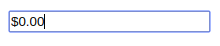

# React Money Input

 

A currency text input for React that Just Works™

- "ATM style" typing, matches user expectations of how a money input should work
- Uses Intl API to display locale accurate currency representations
- Supports custom inputs (e.g. Material UI text fields)
- Returns [`currency.js`](https://github.com/scurker/currency.js/) enforced numeric float values
- Works out of the box with libs like [`Formik`](https://github.com/jaredpalmer/formik)



## Installation

```bash
npm install --save @rschpdr/react-money-input currency.js
```

## Quick Start

```javascript
import React, { useState } from "react";
import MoneyInput from "react-money-input";

function Example(props) {
  const [amount, setAmount] = useState(0);

  function handleChange(e) {
    setAmount(e.target.value);
  }

  return <MoneyInput onChange={handleChange} value={amount} />;
}

export default Example;
```

## Props

| Props          | Options                       | Default                                                                                                                                                                                                          | Description                                                                                                                       |
| -------------- | ----------------------------- | ---------------------------------------------------------------------------------------------------------------------------------------------------------------------------------------------------------------- | --------------------------------------------------------------------------------------------------------------------------------- |
| className      | string                        | ''                                                                                                                                                                                                               | Regular React classname                                                                                                           |
| style          | Styles object                 | {}                                                                                                                                                                                                               | Regular React styles object                                                                                                       |
| currencyConfig | Currency configuration object | <ul> <li>locale: string = "en-US"</li> <li>currencyCode: string = "USD"</li> <li>currencyDisplay: string = "symbol"</li> <li>useGrouping: boolean = true</li> <li>minimumFractionDigits: number = undefined</li> | Config options for Number.toLocaleString method. [See more](https://www.techonthenet.com/js/number_tolocalestring.php)            |
| customInput    | Component Reference           | undefined                                                                                                                                                                                                        | Support for custom inputs e.g. Material UI TextField                                                                              |
| name           | string                        | undefined                                                                                                                                                                                                        | Regular `name` HTML property                                                                                                      |
| id             | string                        | undefined                                                                                                                                                                                                        | Regular `id` HTML property                                                                                                        |
| max            | number                        | Number.MAX_SAFE_INTEGER                                                                                                                                                                                          | Maximum allowed value                                                                                                             |
| onChange       | (event) => any                | undefined                                                                                                                                                                                                        | `onChange` event handler. `event` is a fake Synthetic Event with only `value`, `name` and `id` properties defined inside `target` |
| value          | number                        | undefined                                                                                                                                                                                                        | Input value                                                                                                                       |

## Custom Inputs

Simply pass the custom input component as a prop. Pass the custom input props directly to `MoneyInput`:

```javascript
import React, { useState } from "react";
import { TextField } from "@material-ui/core";
import MoneyInput from "react-money-input";

function Example(props) {
  const [amount, setAmount] = useState(0);

  function handleChange(e) {
    setAmount(e.target.value);
  }

  return (
    <MoneyInput
      customInput={TextField}
      variant="outlined"
      label="Custom Input!"
      onChange={handleChange}
      value={amount}
    />
  );
}

export default Example;
```

## Contributing

All contributions welcome! Feel free to [raise issues](https://github.com/rschpdr/react-money-input/issues) or [submit a PR](https://github.com/rschpdr/react-money-input/pulls).

## License

This project is licensed under the MIT License - see [LICENSE.md](LICENSE.md) for details.

## Acknowledgments

- Based on [larkintuckerllc/react-currency-input](https://github.com/larkintuckerllc/react-currency-input)
- Custom input support based on [
  s-yadav/react-number-format](https://github.com/s-yadav/react-number-format)

Go give them stars!
